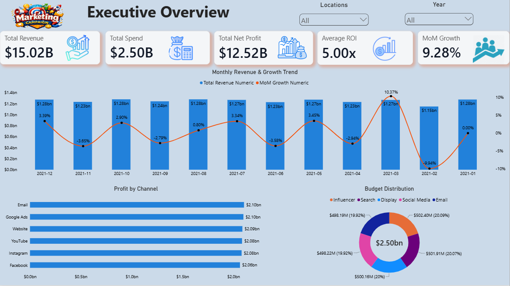
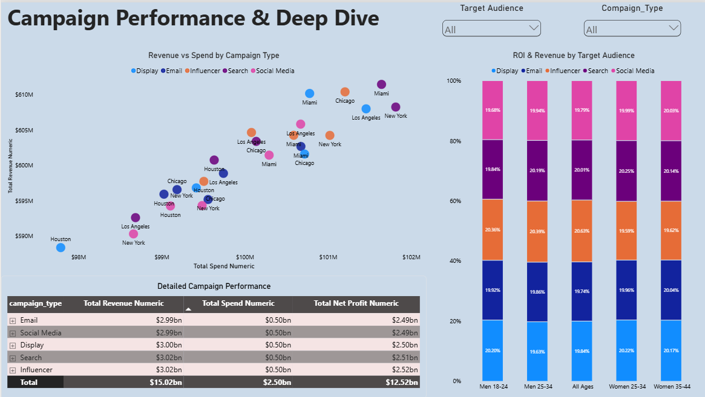
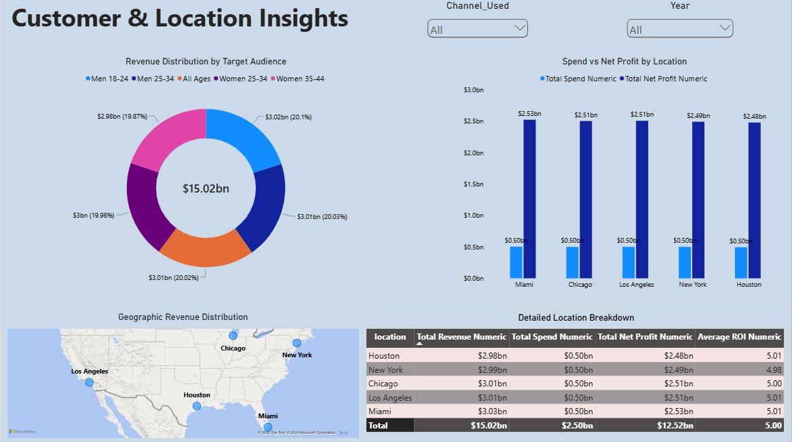

# Marketing Campaign Analytics Project

## Project Overview
This end-to-end data analytics project analyzes marketing campaign performance, channel efficiency, target audience engagement, and regional revenue growth. 
The complete workflow covers data cleaning and exploratory data analysis (EDA) in Python, database schema design and KPI querying in PostgreSQL, and building an interactive 3-page dashboard in Power BI.

The main goal of this project is to organize campaign data into clear, non-redundant visual reports that help marketing teams and managers make data-driven decisions.

## Business Problem
The marketing team lacked a central report to track campaign results across various channels, target demographics, and geographic locations. Key business questions included:
* Which marketing channels (Email, Social Media, Search, Display, Influencer) generate the highest ROI and net profit?
* How effectively is the marketing budget distributed across different target audience age groups?
* How can performance data be displayed clearly across pages without repeating metrics and creating visual clutter?

## Business Objectives
* Track primary business KPIs ($15.02B Total Revenue, $2.50B Total Spend, $12.52B Net Profit, 5.00x Average ROI).
* Analyze channel and campaign profitability to help optimize marketing budget allocation.
* Evaluate demographic and geographic data to identify top-performing customer segments and locations.

## Dataset
* **Rows:** 1,000+ Records
* **Columns:** 15+ Attributes
* **Data Type:** Digital Marketing & Campaign Analytics Data
* **Key Fields:** `campaign_id`, `campaign_type`, `channel_used`, `target_audience`, `location`, `spend`, `revenue`, `net_profit`, `roi`, `date`

## Tools & Technologies
| Tool | Purpose |
| :--- | :--- |
| **Python (Pandas, NumPy)** | Data cleaning, data type validation, missing value handling, and exploratory data analysis (EDA). |
| **PostgreSQL** | Relational database analysis, SQL schema design, KPI querying, and aggregate functions. |
| **Power BI Desktop** | Data modeling, DAX measure creation, UI layout design, and interactive dashboard development. |
| **DAX (Data Analysis Expressions)** | Custom KPIs (`DIVIDE`, `SUM`, `AVERAGE`, `DISTINCTCOUNT`), conditional logic, and calculated columns. |
| **GitHub** | Version control, documentation, and portfolio showcase. |

## Project Workflow
* **Raw Dataset**,
* **Python Data Cleaning & EDA**,
* **PostgreSQL Analysis & Business Queries**,
* **Power BI Data Modeling & DAX Measures**,
* **Interactive 3-Page Power BI Dashboard**,
* **Business Insights & Recommendations**

---

## Python Analysis
Performed initial data cleaning, missing value checks, and data type validation using Python (Pandas) before loading data into PostgreSQL and Power BI.
* Cleaned and formatted currency and date fields.
* Checked categorical fields (`channel_used`, `location`, `target_audience`) for consistency.
* Calculated baseline summary metrics for total spend, revenue, and profit.

**Python Notebook:** [marketing_eda_cleaning.ipynb](03_data_cleaning_and_preprocessing.ipynb)

---

## SQL Analysis
Loaded the cleaned data into PostgreSQL to run business queries and aggregate metrics.
* Created SQL queries to group profit and revenue by marketing channels and target demographics.
* Calculated month-over-month (MoM) growth rates and average return on investment (ROI).
* Structured aggregated data tables for direct analysis and verification.

**SQL File:** [marketing_performance_analysis.sql](04_SQL_Analysis.sql)

---

## Power BI Dashboard
The Power BI report contains 3 dedicated interactive pages:

### 1. Executive Overview
Focuses on overall business health, monthly revenue trends, and total budget breakdown.
* **Core KPIs:** Total Revenue ($15.02B), Total Spend ($2.50B), Total Net Profit ($12.52B), Average ROI (5.00x), MoM Growth (9.28%)
* **Monthly Revenue & Growth Trend:** Line and column chart displaying month-over-month revenue alongside growth percentages.
* **Profit by Channel & Budget Distribution:** Bar chart showing profit per channel alongside a donut chart showing total budget distribution ($2.50B).

### 2. Campaign Performance & Deep Dive
Focuses on campaign efficiency, scatter analysis, and target audience contribution.
* **Core Focus:** Campaign Type Efficiency & Target Audience Analysis
* **Revenue vs Spend by Campaign Type:** Scatter plot mapping total spend against total revenue across cities and campaign channels.
* **ROI & Revenue by Target Audience:** 100% stacked column chart detailing revenue mix across demographic groups (Men 18-24, Women 25-34, etc.).
* **Detailed Campaign Performance Table:** Matrix visual showing campaign spend, revenue, and net profit figures.

### 3. Customer & Location Insights
Focuses on geographic performance mapping and location-based performance metrics.
* **Core Focus:** Regional Performance & Demographic Split
* **Geographic Revenue Distribution:** Map visual showing key revenue locations across major US cities (Miami, New York, Chicago, Los Angeles, Houston).
* **Revenue Distribution by Target Audience:** Donut chart showing revenue breakdown across demographic groups.
* **Spend vs Net Profit by Location & Table:** Column chart paired with a location table comparing spend, net profit, and average ROI (ranging from 4.98x to 5.01x).

**Power BI Dashboard File:** [marketing_executive_dashboard.pbix](05_Marketing_Campaign_Analytics.pbix)

---

## Key KPIs
| KPI | Overall Result |
| :--- | :--- |
| **Total Revenue** | $15.02B |
| **Total Spend** | $2.50B |
| **Total Net Profit** | $12.52B |
| **Average ROI** | 5.00x |
| **MoM Growth Rate** | 9.28% |

---

## Key Business Insights
### Campaign & Channel Performance
* **Top Channels:** Email, Search, and Display channels generate consistent revenue (~$3.00B each), maintaining a stable 5.00x ROI across campaigns.
* **Budget Share:** Total spend ($2.50B) is evenly split across channels (~20% per channel), showing steady marketing operations.

### Demographics & Locations
* **Consistent City Revenue:** Profitability is evenly distributed across major cities including Miami ($2.53B profit), Chicago ($2.51B profit), Los Angeles ($2.51B profit), New York ($2.49B profit), and Houston ($2.48B profit).
* **Target Audience Split:** Age groups (Men 18-24, Men 25-34, Women 25-34, Women 35-44) contribute equally (~20% each) to total revenue.

---

## Business Recommendations
* **Focus on High-ROI Channels:** Allocate more budget to top-performing channels like Search and Email to increase net margins beyond 5.00x.
* **Targeted Ad Campaigns:** Create specific ads for high-converting demographic groups (e.g., Women 25-34) instead of generic targeting.
* **Geographic Expansion:** Maintain steady marketing spend in key cities like Miami and Chicago while testing campaigns in new regional markets.

--- 

## Dashboard Preview

### Executive Overview

### Campaign Performance & Deep Dive

### Customer & Location Insights

